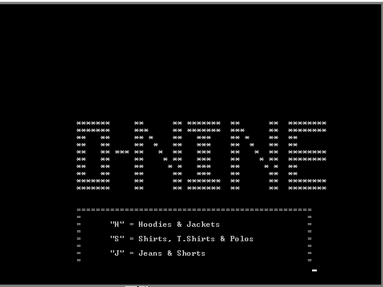
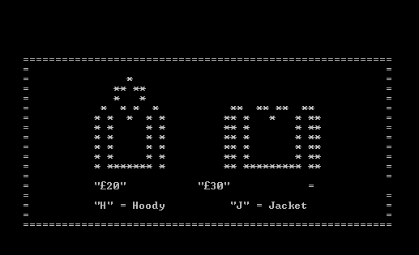

# Assembly-language-ONine-Shopping-Website

## Description

Experience a unique shopping experience with our Assembly language-based website simulation. This project, developed using EMU8086, mimics the functionality and design of a comprehensive online store for a renowned fashion brand. Browse through an array of stylish hoodies, jackets, jeans, shorts, shirts, t-shirts, and polos, all elegantly presented in an assembly-coded interface.

## Features

- **Product Selection:** Explore a curated collection of fashion items including hoodies, jackets, jeans, shorts, shirts, t-shirts, and polos.
- **Interactive Interface:** Navigate through the shopping website using intuitive assembly language commands and simulated user interactions.
- **Order Processing:** Simulate the selection and checkout process for products, showcasing how assembly language handles user inputs and transactions.
- **Visual Presentation:** Enjoy a visually appealing display of products, demonstrating the capabilities of EMU8086 for graphical user interface development.

## Technologies Used

- **EMU8086:** Assembly language emulator used for developing the entire project, showcasing its capability in handling user interface and logic.
- **Graphical User Interface:** Developed using EMU8086's graphics libraries to create an interactive shopping experience.
- **Product Database:** Simulated backend for storing and retrieving product information within the constraints of assembly language.

## How to Use

1. **Launching the Website:** Run the assembly code in EMU8086 to start the simulated shopping website.
2. **Browsing Products:** Navigate through different categories and products using assembly language controls.
3. **Adding to Cart:** Select items and add them to your virtual shopping cart.
4. **Checkout Process:** Simulate the checkout process to see how assembly language manages transactions.

## Contribution and Future Development

This project serves as an educational demonstration of assembly language's capabilities in developing practical applications. Contributions and enhancements are welcome to further refine the user interface, expand product offerings, or optimize performance.

## License

This project is purely educational and not for commercial use.

---

Explore the world of assembly language programming through our simulated shopping website, showcasing the blend of functionality and creativity in digital commerce.

---
